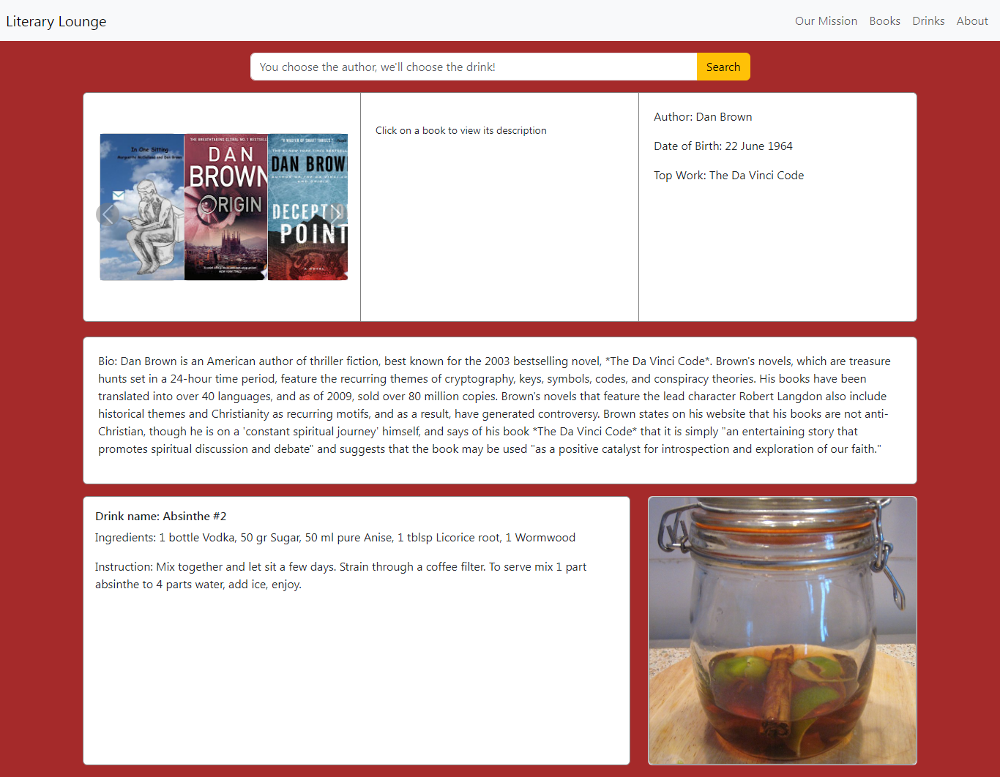

# Literary Lounge App

## Description
Literary Lounge is an innovative app designed to enhance your reading experience. With Literary Lounge, you can easily access information about books by searching for the author. Additionally, the app provides recommendations for drinks to accompany your reading, creating a cozy and enjoyable atmosphere for literary exploration.

## Features
- Search for books by author name
- Retrieve information about books, including title, genre, synopsis, and more
- Receive personalized drink recommendations to pair with your chosen book

## Demo
You can view a live demo of Literary Lounge [here](https://duouk2000.github.io/Literary-Lounge/).

## Screenshots

## Installation
1. Clone the repository: `git clone [repository_url]`
2. Navigate to the project directory: `cd [project_directory]`

## Technologies Used
- HTML: Markup language for creating web pages
- CSS: Cascading Style Sheets for styling web pages
- JavaScript: Programming language for client-side scripting
- Bootstrap: Front-end framework for developing responsive and mobile-first websites

## Contributing
1. Fork the repository
2. Create a new branch: `git checkout -b feature/new-feature`
3. Make your changes and commit them: `git commit -m 'Add new feature'`
4. Push to the branch: `git push origin feature/new-feature`
5. Submit a pull request

## Contributors
- [Oluwadamilola Ajayi](https://github.com/dodomiyake)
- [Andrew Sinkinson](https://github.com/Duouk2000)
- [Shalini Sunkuru](https://github.com/ShaliniSunkuru)
- [Trisha Waku](https://github.com/twaku2324)

## Acknowledgments
- The team at Literary Lounge for their dedication and hard work
- [OpenLibrary API](https://openlibrary.org/developers/api) for book information
- [Google Books API](https://developers.google.com/books) for book information.
- [TheCocktailDB API](https://www.thecocktaildb.com/api.php) for drink recommendations

## Contact
For any inquiries or feedback, please contact Literary Lounge Team. 